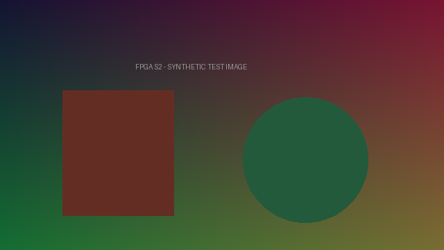
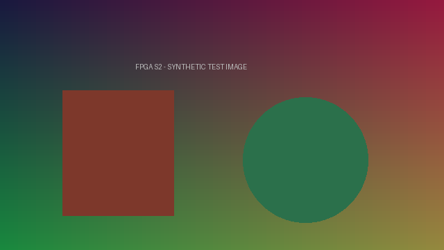
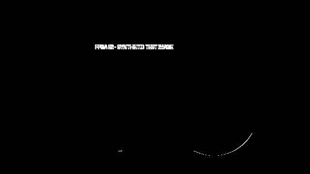

# 安路赛题二：可调图像增强与边缘观察系统

2026 嵌赛 FPGA 安路赛题二，目标 HX1P35A / PH1P35MDG324，摄像头方案 SC500CS。

**当前是第一版 AUTO 预览阶段，尚未完成实板验收；不是最终参赛完成版。** 本仓库只发布团队新增 RTL、独立参考计算、测试与设计说明。完整厂商基础工程及加密 IP 不在公开仓库；本仓库不能单独生成整板位流。HX4S20 借板测试工程不在此仓库。

## 已实现

- 原图、逐 RGB 通道亮度/对比度增强、Sobel 边缘模式。
- 亮度五档 −32/−16/0/+16/+32，对比度 0.75/1/1.25，边缘阈值 40/80/160/320/640。
- 帧边界统一更新参数、逻辑四键去抖、模式切换保留参数。
- OSD 模式/参数/选中标记，接口调用官方字体与 Logo ROM（这些依赖未公开上传）。

历史完整候选在 TD 6.2.1 上完成综合、布局布线及 bitgen；实体按键没有接入，顶层使用 AUTO_PREVIEW=1。受当前约束覆盖的路径通过，但完整时序签核尚未完成。摄像头、DDR、HDMI、稳定性、Flash 与冷启动均未实板验收。

## 在电脑上验证算法

安装 Python 3、Icarus Verilog（iverilog/vvp 加入 PATH），然后在仓库根目录运行：

```text
python -m pip install -r requirements.txt
python scripts/run_tests.py
```

也可用 IVERILOG、VVP 环境变量指定工具路径。看到 ALL_TESTS_PASSED 表示逻辑控制与逐像素参考比较通过，不代表硬件通过。结果在 evidence/portable_test_run.json，图片在 sim/out/preview。

测试覆盖灰阶、随机 RGB、纯色、条纹、边界档位、复位、连续帧、无效周期和 1280 列行缓存；没有验证厂商 IP。全显示接口测试只随队友内部包提供，使用的是明确受限的 FIFO 替代模型。

## 图片：电脑端 RTL 仿真，非摄像头实拍

原始测试图：



增强输出：



边缘输出：



## 接续位置

- `rtl/s2_pixels.v`：像素算法。
- `rtl/s2_controls.v`：参数状态和按键同步/去抖。
- `rtl/s2_mixer.v`：显示流适配和 AUTO 预览。
- `rtl/s2_osd.v`：文字、参数与 Logo 接口。
- [设计与公式](docs/architecture.md)、[时序未完成项](docs/timing_review.md)、[依赖和来源](THIRD_PARTY.md)。

后续：确认实物与原理图、接入实体键、完善 I²C/DDR/CDC/板级约束、重新构建，先验证官方采集显示基线，再验证集成候选、Flash 和冷启动。内部验收计划为基础画面 30 分钟、最终版本 2 小时、100 次模式切换和 10 次冷启动，均未完成；这些数字不是官方规定。

代码与测试由团队在 AI 辅助下开发和整理，需要团队成员理解并实测。保留官方/第三方来源，不将其计作团队原创。公开可见不等于已授予开源许可证，详见 LICENSE_NOTICE.md。
